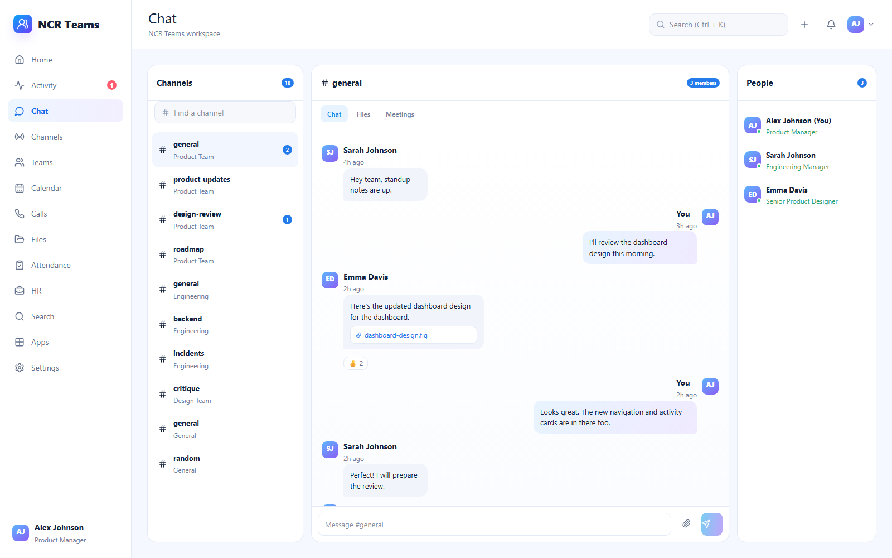
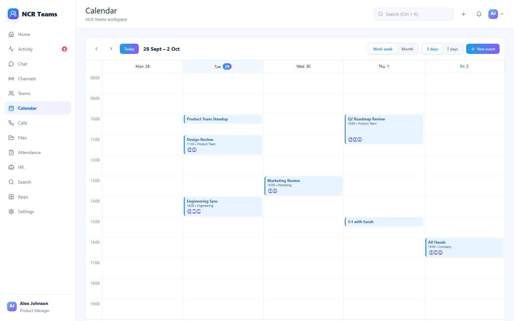
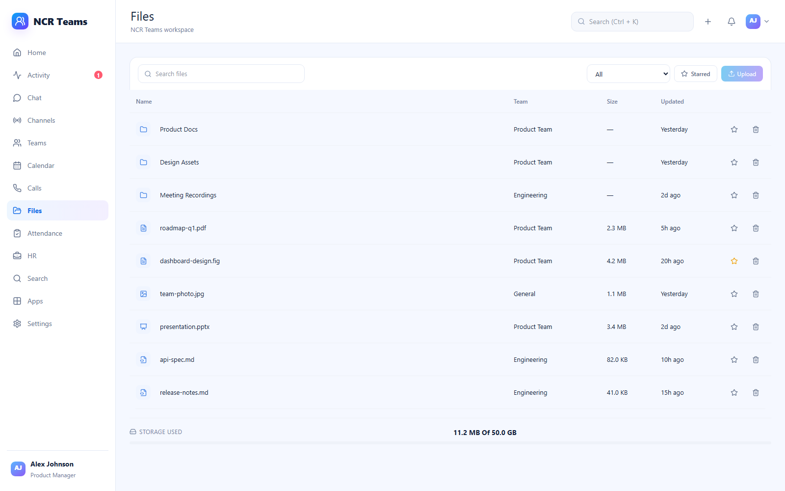
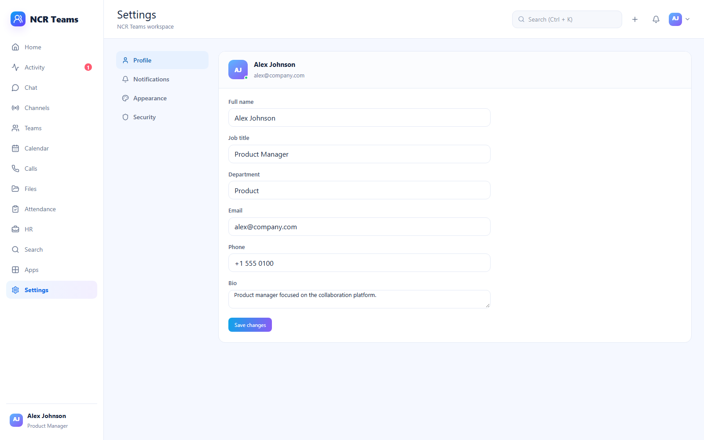

# NCR Teams


[](https://ncr-teams.vercel.app)


A Microsoft Teams-style collaboration workspace — chat, channels, meetings,
files, calendar, attendance and HR.

The repository is split into three folders by concern: **`frontend/`** holds the
app that ships to the browser, **`backend/`** holds the API it will talk to, and
**[`database/`](./database)** holds the schema that API will use.

## Screenshots

| | |
| --- | --- |
|  <br/> **Chat** — channels, threads, reactions |  <br/> **Calendar** — week and month, 5 or 7 day |
|  <br/> **Files** — folders, starring, storage meter |  <br/> **Settings** — profile, notifications, appearance |

## Status

| Folder | State |
| --- | --- |
| `frontend/` | **Complete.** 18 routes, mock data, no backend. |
| `backend/` | **Specified only.** The API contract is written down; no code. |
| `database/` | **Specified only.** The schema is designed; no migrations. |

### Please read this before judging the backend

The frontend is deliberately self-contained. It reads from an in-memory fixture
module, so it runs with no services to install, no database, and no environment
variables to set. **Nothing is persisted** — every interaction mutates local
React state and resets on reload.

`backend/` and `database/` contain only a README each: a written API contract
(~40 endpoints) and a written schema (17 entities). They are specifications, not
implementations, and they are labelled as such. The point of the three-folder
layout is that when the backend is built, the swap is confined to the data layer
rather than rippling through the screens.

## Running it

```bash
npm install     # installs the workspace
npm run dev     # http://localhost:3000
```

If 3000 is taken:

```bash
npm run dev -- -p 3003
```

Other scripts: `npm run build`, `npm start`, `npm run typecheck`. They all
delegate to the `frontend` workspace.

## Layout

```
.
├── frontend/                  Next.js 15 App Router, React 19, TypeScript, Tailwind 4
│   ├── app/                   routing only — one folder per route
│   │   ├── (app)/             the signed-in shell: 14 routes, plus
│   │   │                      layout.tsx, loading.tsx, error.tsx
│   │   ├── login/             four auth walkthroughs sit at the app root,
│   │   ├── activate/          not in a route group — they share a component
│   │   ├── forgot-password/   (components/auth/AuthLayout.tsx) rather than
│   │   ├── verify-2fa/        a layout
│   │   ├── layout.tsx
│   │   └── globals.css        the whole design system, no CSS framework
│   ├── components/            UI, grouped by feature
│   ├── lib/                   data.ts (fixtures), format.ts, nav.ts
│   └── ...
│
├── backend/                   API service — scaffold only
│   └── README.md              endpoint contract, realtime protocol, stack
│
└── database/                  schema design — scaffold only
    └── README.md              entities, constraints, conventions, seed plan
```

This is an npm workspace: one `npm install` at the root covers every package.
`frontend/` is its own Next.js project because the App Router requires `app/` to
sit at a project root — it cannot be relocated to an arbitrary depth.

## The frontend

18 routes: 14 authenticated, plus 4 auth screens. No backend, no authentication,
no persistence.

| Route | What it does |
| --- | --- |
| `/` | Dashboard — greeting, stat cards, today's meetings, activity |
| `/activity` | Combined activity feed and upcoming events |
| `/apps` | Launcher |
| `/attendance` | Check in/out, personal history, team board |
| `/calendar` | Week and month views, 5 or 7 day toggle, event CRUD |
| `/calls` | Call history and upcoming links |
| `/channels` | Channel directory grouped by team |
| `/chat` | Channels, threads, reactions, composer |
| `/files` | File table, folders, starring, storage meter |
| `/hr` | Leave approvals, departments, directory |
| `/meetings` | Meeting list and the in-room experience |
| `/search` | Ranked search with scope filters and term highlighting |
| `/settings` | Profile, notifications, appearance, security |
| `/teams` | Team grid with create and join |
| `/login`, `/activate`, `/forgot-password`, `/verify-2fa` | Mock auth walkthroughs |

### Conventions worth knowing

- `lib/data.ts` is the single source of demo data. It exports typed fixtures
  plus its own types, so there is nothing to configure before running.
- `lib/format.ts` holds pure, dependency-free helpers. It is imported by client
  components, so it must never pull in a server-only package.
- `lib/nav.ts` is the route registry. Adding a route means adding one entry.
- `app/globals.css` carries the design tokens in a Tailwind `@theme` block.
  `:root` derives its variables from it, so the palette has one source of truth.
- `@/*` resolves to the `frontend/` root.

## Tech decisions

**The `@/*` alias is what made the monorepo move free.** It maps to `./*`
*relative to the tsconfig*, not to the repository root. When the app moved from
the repo root into `frontend/`, the tsconfig moved with it, so `@/lib/format`
kept resolving to `frontend/lib/format` and **not one import statement needed
rewriting**. Git recorded the move as renames with 100% similarity. It also
means `@/app/...` always means the frontend, never the backend.

**Attendance stores a `date`, not a timestamp.** The first build generated
`DD/MM/YYYY` strings, which `new Date()` cannot parse — every row rendered
"Invalid Date" *and* the status lookup silently failed, so the whole team showed
as not-checked-in. The fix was `YYYY-MM-DD` keys plus a `parseDayKey` helper that
builds a local date, since `new Date('2026-09-29')` is UTC midnight and renders
as the previous day west of Greenwich. The schema in `database/` carries the same
decision as a `date` column with a composite `(user_id, date)` primary key, which
also makes check-in idempotent for free.

**Most layout bugs had one root cause.** Interactive elements are `<button>`s, and
several class names set colour and typography but never reset the UA background
or border. The chat channel rows shrink-wrapped and painted grey boxes over each
other. A single reset fixed a whole class of problems, and it is why
`.conversation`, `.join` and `.file-link` all carry explicit `background: none`
and `width: 100%` rather than inheriting anything.

**Search ranks by match quality, then recency.** `exact > prefix >
word-boundary > substring`, so a search for "design" puts the "design" channel
above a file called `redesign-notes.md`. Scores are computed per field, so a hit
in a job title can outrank a hit in a long message body.

## Where this is going

The intended next milestone is a real backend, in this order:

1. `database/` — migrations and seed matching the documented entities.
2. `backend/` — the endpoints in `backend/README.md`, replacing `lib/data.ts`.
3. Auth and row-level security, so the mock sign-in screens become real.
4. WebSocket delivery for messages and presence.
5. File upload to object storage.

Nothing above requires a structural change. Pages already receive plain objects,
and the mutating handlers are isolated in client components, so the data layer
can be swapped without touching layout or design.

## Licence

MIT — see [LICENSE](./LICENSE).
